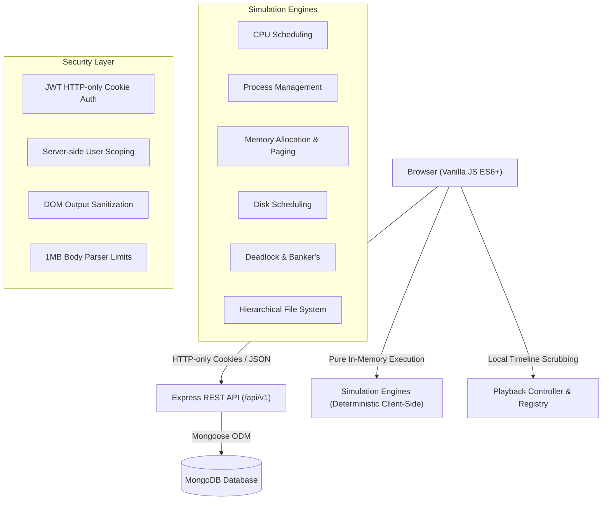

# OS Simulator Platform — Interactive Operating Systems Laboratory

A comprehensive, interactive Operating Systems simulation and laboratory platform designed for computer science education and technical demonstration. Built entirely with Vanilla JavaScript ES6+ modules, HTML5, CSS3, Node.js, Express, MongoDB, and Mongoose — with zero heavy frontend frameworks.

---

## Highlights & Features

- **6 Core Simulation Modules**:
  1. **CPU Scheduling**: FCFS, SJF (Preemptive/Non-Preemptive), Priority (Preemptive/Non-Preemptive), and Round Robin with interactive Gantt charts, metrics, and timeline scrubbing.
  2. **Process Management**: 5-state lifecycle (New, Ready, Running, Waiting, Terminated), Process Control Blocks (PCBs), scheduling queues, and context switching.
  3. **Memory Management**: Contiguous allocation (First Fit, Best Fit, Worst Fit) and Virtual Memory Paging with page tables, page faults, and page replacement algorithms (FIFO, LRU, Optimal).
  4. **Disk Scheduling**: FCFS, SSTF, SCAN, C-SCAN, LOOK, and C-LOOK with head trajectory charts and total head movement calculations.
  5. **Deadlock Management**: Resource Allocation Graphs (RAGs), cycle detection, and Banker's Algorithm (Safety and Resource Request).
  6. **File System**: In-memory hierarchical Virtual File System (VFS), directory navigation, contiguous block allocation, and open-file tables.

- **Structured Learning & Educational Layer**:
  - **Learning Hub (`#/learn`)**: Centralized catalog across all 6 OS topics with instant keyword search.
  - **Worked Examples & Simulator Handoff**: Each module contains step-by-step worked numerical examples with a "Try in Simulator" action that preloads configurations directly into simulation engines.
  - **Interactive Knowledge Checks**: 38 multiple-choice questions with real-time feedback, detailed explanations, and score tracking.

- **User Persistence & History**:
  - Save custom simulation configurations for later retrieval.
  - Automatic simulation history logging with run metrics.
  - Learning progress tracking with module completion toggles.
  - **Guest Access**: Complete, unrestricted client-side access to all 6 simulators and learning modules without requiring login.

- **Modern Technical UI & Design System**:
  - Professional, clean, sleek, high-contrast dark laboratory aesthetic by default (`#090d16` obsidian slate, `#0f172a` elevated surfaces, `#1e293b` crisp borders).
  - Responsive application shell with mobile drawer and backdrop overlay.
  - Semantic CSS variables, accessible focus states (`:focus-visible`), and `@media (prefers-reduced-motion: reduce)`.
  - Light theme alternative available via the theme toggle button (`[data-theme="light"]`).

- **Security & Reliability**:
  - Authentication via JWT stored in secure `HTTP-only` cookies (no tokens in `localStorage` or `sessionStorage`).
  - Passwords hashed using `bcryptjs`.
  - Server-side IDOR protection ensuring user-isolated resources.
  - DOM XSS prevention through HTML sanitization (`escapeHtml`).
  - Explicit server payload bounds (`1mb` limit on JSON and URL-encoded bodies).
  - 100% automated test coverage with **363/363 passing tests across 26 test files**.

---

## Tech Stack

| Layer | Technologies |
|---|---|
| **Frontend** | HTML5, CSS3, Vanilla JavaScript (Native ES6+ Modules, No React/Vue/TypeScript) |
| **Backend** | Node.js, Express.js (RESTful API) |
| **Database** | MongoDB, Mongoose ODM |
| **Authentication** | JSON Web Tokens (JWT) in HTTP-only cookies, bcryptjs |
| **Visualization** | Chart.js & Custom Canvas/DOM Renderers |
| **Testing** | Vitest (363 automated unit, integration, and security tests) |

---

## Architecture Overview



### 1. Client-Side Simulation Execution
- Every simulation algorithm is implemented as a pure, deterministic JavaScript function.
- Execution yields an immutable `SimulationResult` snapshot timeline, allowing users to scrub forward and backward step-by-step without re-running computations.
- Simulations operate independently of backend availability — guests and offline users enjoy full simulation capability.

### 2. Backend & Persistence
- When authenticated, users can persist custom presets (`/api/v1/simulations`), view run history (`/api/v1/history`), and track topic mastery (`/api/v1/progress`).
- All database queries are strictly scoped to the authenticated user ID extracted from verified JWTs.

---

## Project Structure

```text
os-simulator/
├── server/
│   ├── config/db.js                 # MongoDB connection
│   ├── controllers/
│   │   ├── authController.js        # Registration, login, logout, profile
│   │   ├── simulationController.js  # Saved simulation CRUD (IDOR-protected)
│   │   ├── historyController.js     # Simulation run logs (IDOR-protected)
│   │   └── progressController.js    # Learning progress tracking (IDOR-protected)
│   ├── middleware/
│   │   ├── authMiddleware.js        # JWT cookie verification & user hydration
│   │   └── errorMiddleware.js       # Standardized JSON error handler
│   ├── models/
│   │   ├── User.js                  # User schema with bcrypt & hidden password
│   │   ├── SavedSimulation.js       # Saved configs schema
│   │   ├── SimulationHistory.js     # Run history schema
│   │   └── LearningProgress.js      # Topic completion schema
│   ├── routes/                      # REST route definitions
│   ├── app.js                       # Express app configuration & static middleware
│   └── server.js                    # Server startup entrypoint
├── public/
│   ├── index.html                   # High-contrast application shell & navigation
│   ├── css/
│   │   ├── main.css                 # Design tokens, variables & typography
│   │   ├── layout.css               # Sidebar, topbar, mobile drawer & grid
│   │   ├── components.css           # Cards, buttons, tables, badges, dialogs
│   │   └── modules/                 # Simulation & learning stylesheets
│   │       ├── cpu.css
│   │       ├── process.css
│   │       ├── memory.css
│   │       ├── disk.css
│   │       ├── deadlock.css
│   │       ├── filesystem.css
│   │       └── learning.css
│   └── js/
│       ├── core/
│       │   ├── store.js             # Reactive state store
│       │   ├── router.js            # Hash-based SPA router with 404 fallback
│       │   ├── apiClient.js         # Fetch wrapper with credentials
│       │   ├── simulationEngine.js  # Abstract engine contract
│       │   ├── simulationRegistry.js# Decoupled algorithm registry
│       │   ├── playbackController.js# Step-by-step timeline scrubber
│       │   └── simulationTracker.js # Client-side persistence & handoff tracker
│       ├── engines/                 # 6 Deterministic simulation engines
│       ├── learning/                # Educational content, quizzes, and search
│       ├── utils/                   # Helpers & sanitize.js (DOM XSS prevention)
│       ├── views/                   # View controllers (Dashboard, Simulators, Hub, Auth)
│       └── app.js                   # Client entrypoint & route registration
└── tests/                           # 26 automated Vitest test suites (363 tests)
    ├── auth/
    ├── core/
    ├── cpu/
    ├── deadlock/
    ├── disk/
    ├── filesystem/
    ├── integration/
    ├── learning/
    ├── memory/
    ├── persistence/
    ├── process/
    ├── security/
    └── ux/
```

---

## API Reference

All protected endpoints require a valid JWT passed via `os_auth_token` HTTP-only cookie.

| Method | Endpoint | Description | Auth Required |
|---|---|---|---|
| `POST` | `/api/v1/auth/register` | Register a new user | No |
| `POST` | `/api/v1/auth/login` | Login user & set HTTP-only cookie | No |
| `POST` | `/api/v1/auth/logout` | Clear auth cookie | Yes |
| `GET` | `/api/v1/auth/me` | Fetch authenticated user profile | Yes |
| `PATCH` | `/api/v1/auth/me` | Update name or password | Yes |
| `GET` | `/api/v1/simulations` | List user's saved simulations | Yes |
| `POST` | `/api/v1/simulations` | Save a new simulation configuration | Yes |
| `DELETE` | `/api/v1/simulations/:id` | Delete a saved simulation (IDOR-checked) | Yes |
| `GET` | `/api/v1/history` | Retrieve user simulation history | Yes |
| `POST` | `/api/v1/history` | Log completed simulation run | Yes |
| `DELETE` | `/api/v1/history` | Clear user history | Yes |
| `GET` | `/api/v1/progress` | Fetch user learning progress | Yes |
| `PATCH` | `/api/v1/progress/:module` | Toggle module completion status | Yes |

---

## Getting Started

### 1. Prerequisites
- [Node.js](https://nodejs.org/) (v18 or higher recommended)
- [MongoDB](https://www.mongodb.com/) (local instance or MongoDB Atlas)

### 2. Installation
```bash
npm install
```

### 3. Environment Configuration
Create a `.env` file in the project root:
```env
PORT=5000
MONGODB_URI=mongodb://localhost:27017/os-simulator
JWT_SECRET=your_jwt_secret_key_here
JWT_EXPIRES_IN=7d
NODE_ENV=development
```

### 4. Running the Application
```bash
# Start server in production mode
npm start

# Start server in development mode (auto-reload)
npm run dev
```

Visit `http://localhost:5000` in your browser.

### 5. Running Automated Tests
The platform includes 363 automated unit, integration, and security tests running offline via Vitest:

```bash
# Run all tests once
npm test -- --run

# Run tests in watch mode
npm test
```

---

## License

This project is open source and available under the [MIT License](LICENSE).
